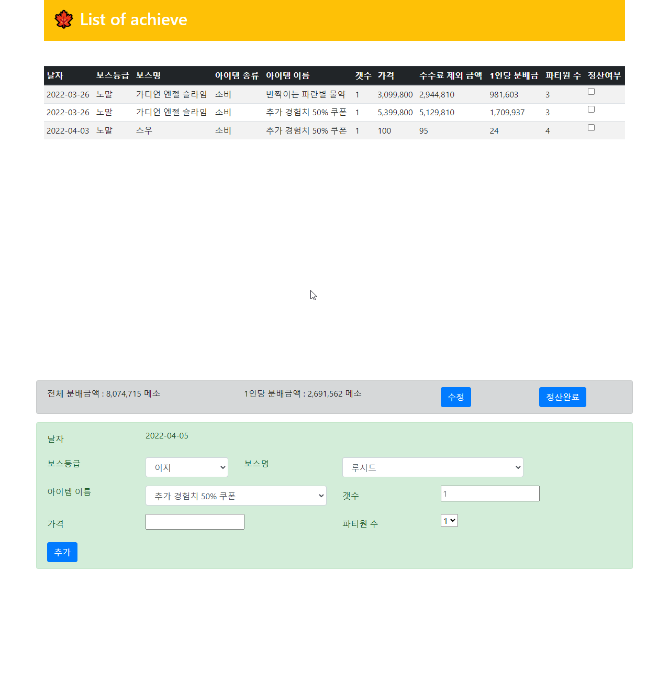
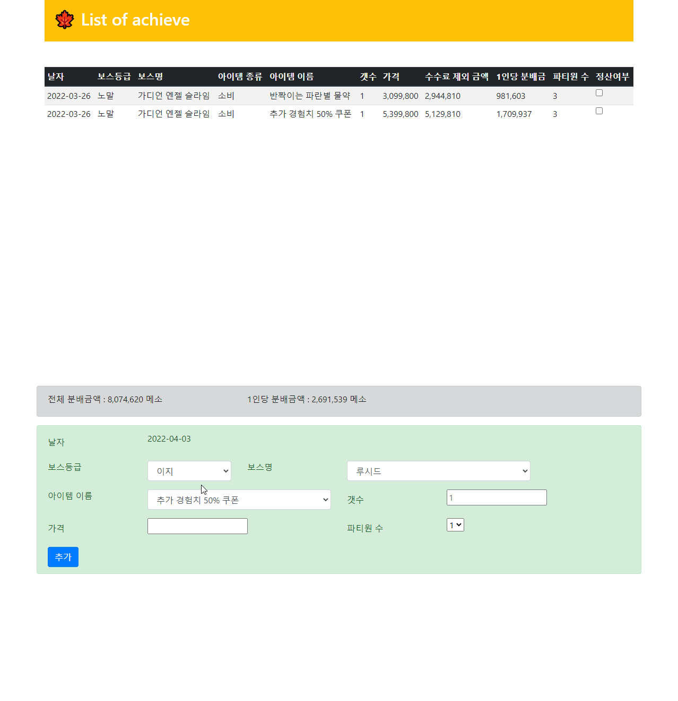
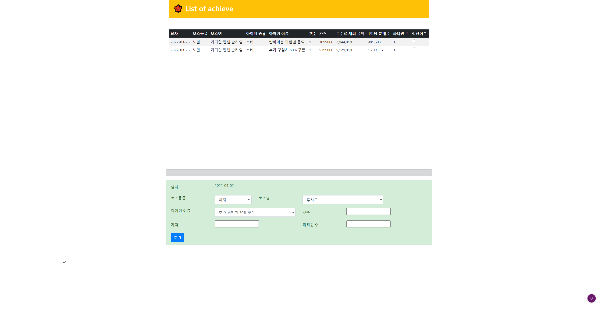
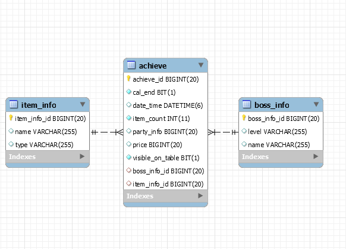

# Calculate 
### 진행사항  

* 2022/05/06
    - 버그수정
        + 신규 추가 이후 수정시 Checkbox값이 변경
            + 하지만 테이블상 변경점은 없음(내부 값만 수정)
            + 해결 : layout으로 되어있는 부분을 제거하고 checkbox에 margin을 주어 가운데쯤 위치 할수 있도록 수정
        + 로그화 변경시 테이블 상 값 변경없음
            + 원인 : 내부 setVisible만 true로 변경
            + 해결 : visibleList에서 제거

 

* 2022/04/06
    - 정산 완료 수정
        + 기존 Achieve 항목에 있던 정산완료 버튼을 ItemModify 항목으로 이동
    - 목록 삭제 작성
        + ItemModify 항목에 체크박스 추가 
        + 전체 선택 및 해제 가능하도록 구현
        + 선택된 항목은 DB에서도 제외
    - 로그화 된(전체) 내용 보기 
        + 로그화 동작 버튼 생성 및 구현
        + 기존 정산된 항목의 내역을 확인 가능하도록 구현

 

* 2022/04/05
    - 데이터 수정 구현
        + 각각의 항목에 onChange 이벤트 지정
    - 정산 완료 버튼( 일괄 CalEnd 항목 true로 변경) 구현
    - 정산여부에 대하여 전채 분배금액 및 1인당 분배금액 값 자동 수정
    - 수정 예정 사항
        + 정산완료 버튼이나 수정단계에서 onclick 이벤트로 인한 fetch가 과다하게 발생하는점 해결 예정

    - 현재까지의 상태   
         
        

 

* 2022/04/04
    - 데이터 수정 버튼 클릭시 이동 화면 추가
    - 데이터 수정시 동작 미구현상태    
        + 한줄당 수정은 여러번하기 불편할 듯 하여 테이블 자체를 불러와서 변경예정
        + 해당부분에서 구현에 어려움 겪는 중 
            + 객체를 동적으로 테이블화 하다보니 받아오는 것이 어려움
            + form으로 넘겨오는것은 field가 value나 text를 지워버리는 경우가 있어 일일이 지정
            + form으로 넘겨올때 id지정이 힘듬
                + 받아오는 리스트를 모델에 추가하였지만 받아오질 못함.
   

  
 
* 2022/04/03
    - 데이터 추가시 오류 발생 Alert 화면 추가
    - 데이터 추가시 보스정보(등급, 이름), 파티원 수 유지
    - 현재까지 상태   
        

  
 
* 2022/04/02
    - 데이터 삽입 부분 추가
    
    - Thymeleaf 수정
        + 기존 모델에서 계산된 값을 넘겨주는 것을 클라이언트측에서 계산
    - 현재까지 상태   
        

  

* 2022/04/01
    - DB 테이블 수정
        + ERD 
        </img>
    -  전체 조회 / visible_on_table 값에 따른 조회 구현 
        </img>

  
 
* 2022/03/31 

    - DB설계
        + ERD 
        </img>
    - Entity작성
        + Achieve
        + Boss
        + Item

